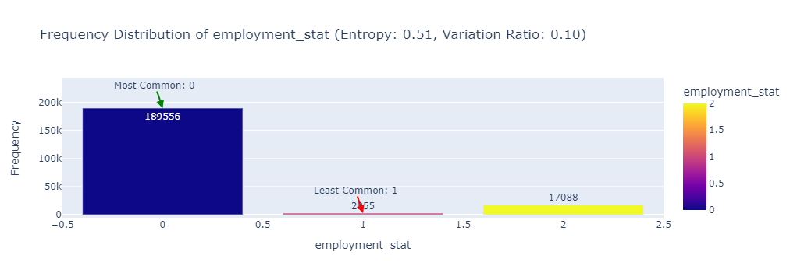
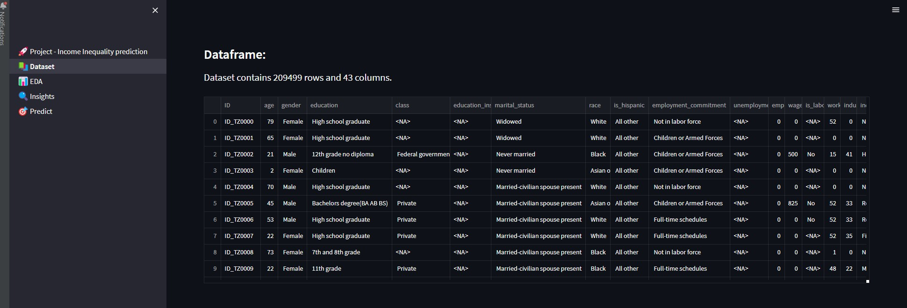

## Machine Learning Solution Predicting Income Inequality


<br>
<br>
<p align="center">
  
</p>
<br>

1. [Introduction](#introduction)
   - [Project Description](#description)
   - [Project Motivation](#motivation)
2. [Project Overview](#project_overview)
   - [Dataset Overview](#datasetoverview)
   - [Problem Statement](#problemstatement)
3. [Project Plan](#projetc_plan)
4. [Income Inequality Classification - EDA](#eda)
5. [Project Directory Structure](#app)
6. [Requirements](#requirements)
7. [Usage](#usage)
8. [Explainable AI (XAI) with SHAP](#xai)
9. [Overview of Scripts](#scripts)
11. [License](#license)
12. [Acknowledgements](#acknowledgements)
13. [Contact Information](#contact)


## Introduction <a name="introduction"></a>
### Project Description <a name="description"></a>
Income inequality - when income is distributed in an uneven manner among a population - is a growing problem in developing nations across the world. With the rapid rise of AI and worker automation, this problem could continue to grow if steps are not taken to address the issue. This solution can potentially reduce the cost and improve the accuracy of monitoring key population indicators such as income level in between census years. This information will help policymakers to better manage and avoid income inequality globally.

### Project Motivation <a name="motivation"></a>
The project aims to address income inequality in developing nations through the use of advanced machine learning algorithms. By leveraging AI and automation, the project seeks to provide cost-effective and accurate predictions of income inequality, benefiting policymakers in their efforts to reduce disparities.

## Project Overview <a name="project_overview"></a>
### Overview Income Inequality Dataset <a name="datasetoverview"></a>
The Income Inequality dataset is a substantial collection of information curated for research purposes, presenting a detailed snapshot of socio-economic attributes. Comprising a vast dataset with 209,499 data points, each defined by 43 unique features, this resource offers a comprehensive view of individuals' socio-economic profiles. It encompasses a diverse set of attributes, including discrete, continuous, and categorical variables, reflecting the complexity of income inequality analysis. The binary target variable, 'income_above_limit,' distinguishes individuals as either 'Below limit' (representing 93.80% of the dataset) or 'Above limit' (constituting 6.20% of the data). This dataset serves as a valuable foundation for in-depth research and modeling, enabling a holistic examination of income disparities and potentially informing policies and initiatives aimed at addressing income inequality.
### Income Inequality Project Problem statement <a name="problemstatement"></a>
The target feature is income_above_limit which is a binary-class variable. The objective of this challenge is to create a machine learning model to predict whether an individual earns above or below a certain amount. Your metric for evaluation will be "F1 score."

## Project Plan <a name="projetc_plan"></a>

In this project, we are addressing the challenge of working with an imbalanced dataset. Our objective is to explore various data preprocessing techniques to mitigate this issue. Some frequently used methods include applying oversampling techniques such as **RandomOverSampler**, **SMOTE** (Synthetic Minority Over-sampling Technique), **ADASYN** (Adaptive Synthetic Sampling), and **BorderlineSMOTE**.

In the initial phase, we will commence by splitting the dataset into training and testing sets using **stratified splitting**. Following that, we will perform basic feature engineering and address missing values using the **K-nearest neighbors (KNN)** imputation method. Subsequently, we will delve into generating synthetic data through different aforementioned techniques. These generated datasets will be saved for later use.

Our base model for this project will be the **random forest** algorithm. We will evaluate the performance of various **sampling techniques** to determine which one yields the best results. The top-performing techniques will be shortlisted and saved in a YAML file for future reference.

Next, we will explore a variety of classification models, including **CatBoost**, **ExtraTrees**, **XGBoost**, and others, to assess their performance. We will also employ **tree-based feature importance techniques** to identify the top 10 features that contribute the most to predictive accuracy. These top features will then be evaluated using the aforementioned classification models.

Upon completing these steps, we will identify the best-performing model and proceed with **hyperparameter tuning** to further enhance its performance.

<p align="center"> 

</p>

## Income Inequality Classification - EDA <a name="eda"></a>

As we all know that the objective of Exploratory Data Analysis (EDA) is to gain insights and understanding from a dataset before applying any specific statistical or machine learning techniques. EDA involves examining and visualizing the data to uncover patterns, spot anomalies, and discover relationships between variables. It helps us to formulate hypotheses, identify data quality issues, and make informed decisions about the next steps in their analysis.

**The EDA Notebook is available [here](http://nbviewer.jupyter.org/github/marcotav/deep-learning/blob/master/painters-identification/notebooks/capstone-models-final-model-building.ipynb).**

Please find below a screenshot captured from the EDA (Exploratory Data Analysis) Jupyter notebook.
<p align="center"> 

</p>
<p align="center"> 

</p>
<p align="center"> 

</p>
<p align="center"> 

</p>
<p align="center"> 

</p>
<p align="center"> 

</p>
<p align="center"> 

</p>
<p align="center"> 

</p>
<p align="center"> 

</p>
<p align="center"> 

</p>
<p align="center"> 

</p>
<p align="center"> 

</p>
<p align="center"> 

</p>
<p align="center"> 

</p>
<p align="center"> 

</p>
<p align="center"> 

</p>


## Project structure <a name="directorystructure"></a>
```bash
├── data
│   ├── final                      # Data after training the model
│   │   └── feature_importances    # Feature importance data
│   ├── processed                  # Data after preprocessing
│   │   └── sample_data            # Processed sample data
│   └── raw                        # Raw data
├── .gitignore                     # Gitignore configuration
├── Makefile                       # Makefile for useful commands
├── models                         # Directory to store trained models
├── pages                          # Directory to store trained models
│   ├── 2_📚Dataset.py             # Python script for handling dataset
│   ├── 3_📊_EDA.py                # Python script for exploratory data analysis
│   ├── 4_🔍Insights.py            # Python script for generating insights
│   └── 5_🎯Predict.py             # Python script for making predictions
├── notebooks                      # Notebooks directory
├── requirements.txt               # List of project dependencies
├── README.md                      # Project README
├── 1_🚀Project - Income Inequality prediction.py # Python script for the streamlit
├── src                            # Source code directory
│   ├── get_dataset.py             # Script to download data
│   ├── preprocessing.py           # Script for data preprocessing
│   ├── oversampler.py             # Script for oversampling techniques
│   ├── undersampler.py            # Script for undersampling techniques
│   ├── combined_sampling.py       # Script for combined sampling
│   ├── Analyzing_Synthetic_Data.py # Script for analyzing synthetic data
│   ├── base_model_evaluation.py   # Script for evaluating base models with synthetic data
│   ├── classification_model_evaluation_FS.py # Script for evaluating models with feature selection
│   ├── feature_selection.py       # Script for feature selection
│   ├── feature_selection_analysis.py # Script for evaluating models after feature selection
│   ├── hp_tunnig_et.py            # Script for hyperparameter tuning of the ExtraTree model
│   └── train_and_evaluate_model.py # Script for training and evaluating the ExtraTree model
│   └── dev                         # Subdirectory for development scripts
│       ├── preprocessing.py        # Development script for preprocessing
│       ├── preprocessing_oversampler.py # Development script for preprocessing with oversampling
│       ├── hp_tunning.py           # Development script for hyperparameter tuning
│       └── train.py                # Development script for model training
```
## Installation <a name="requirements"></a>
The code requires Python versions of 3.*, following libraries and packages used in this project:

* **pandas**: A versatile and powerful data manipulation library that is instrumental in data analysis and preprocessing tasks.

* **streamlit**: A user-friendly Python library that simplifies the creation of web applications and interactive dashboards, making it easy to showcase project results.

* **plotly**: A library used to create interactive and visually appealing plots and charts, enhancing data visualization capabilities.

* **scikit-learn**: A comprehensive and widely-used machine learning library that provides tools for building, training, and evaluating machine learning models.

* **kaggle**: The Kaggle API, which allows access to datasets and competitions hosted on Kaggle, facilitating data retrieval and participation in machine learning challenges.

* **imblearn**: A library specifically designed for addressing imbalanced datasets by providing techniques for resampling and handling class imbalances.

* **pyyaml**: A Python library used for working with YAML configuration files, often utilized to manage project configurations.

* **lightgbm**: A gradient boosting framework known for its efficiency and performance, frequently used in machine learning tasks.

* **catboost**: A gradient boosting library with a strong focus on handling categorical features effectively, contributing to improved model accuracy.

* **xgboost**: An optimized gradient boosting library that is renowned for its speed and ability to achieve high performance in machine learning tasks.

* **feature_engine**: A library that specializes in feature engineering and data preprocessing, aiding in data transformation and preparation for model training.

* **scikit-optimize**: A library used for hyperparameter tuning and Bayesian optimization, assisting in finding optimal model configurations.

* **shap**: A library that plays a crucial role in explaining machine learning models and interpreting their predictions, enhancing model transparency and understanding.

## Usage <a name="usage"></a>
#### 1. Clone this repository:
```bash
git clone https://github.com/zubairashfaque/Road-Traffic-Accident-Classification
```
#### 2. Run the following command to create a virtual environment named "Income Inequality" (you can replace "Income Inequality" with any name you prefer):
```bash
python -m venv income_prediction
```
#### 3. To activate the virtual environment, use the following command:
```bash
income_prediction\Scripts\activate
```

#### 4. To install the necessary packages from the `requirements.txt` file, you have two convenient options:

Option 1: Run the following command directly in your terminal:

```bash
pip install -r requirements.txt
```

Option 2: Alternatively, if you prefer using a Makefile for streamlined setup, you can execute the following command:

```bash
make install
```

Either of these methods will ensure that all required packages are installed, setting up your environment for seamless project execution.


Both of these commands automate the process of fetching the Income Inequality dataset, making it easily accessible for subsequent analysis and preprocessing.

#### 5. To preprocess the CSV Income Inequality dataset, you can choose from two straightforward options:

Option 1: Run the following command directly in your terminal:

```bash
python src/preprocessing.py data/raw/ data/processed
```

Option 2: Alternatively, if you prefer using a Makefile to streamline the preprocessing process, you can execute the following command:

```bash
make exe_preprocessing
```

Either of these methods will initiate the dataset preprocessing, ensuring that it's ready for further analysis and machine learning tasks.

#### 6. To employ various oversampling techniques and generate synthetic samples for minority class instances in the dataset, you can choose from two convenient options:

Option 1: Run the following command directly in your terminal:

```bash
python src/oversampler.py data/raw/ data/processed
```

Option 2: Alternatively, if you prefer using a Makefile to streamline the oversampling process, you can execute the following command:

```bash
make gen_oversampler
```

Using either of these methods, you can effectively address class imbalance issues and enhance the dataset for improved machine learning model training and performance.

#### 7.   To evaluate the performance of oversampling techniques, you have two convenient options:

Option 1: Run the following command directly in your terminal:

```bash
python src/Analyzing_Synthetic_Data.py
```

Option 2: Alternatively, if you prefer using a Makefile to streamline the process, you can execute the following command:

```bash
make analyze_synthetic_data
```

By choosing either of these methods, you can assess the effectiveness of various sampling strategies and make informed decisions to enhance your dataset for machine learning model training.

#### 8.   To evaluate the performance of undersampling and oversampling techniques, you have two convenient options:

Option 1: Run the following command directly in your terminal:

```bash
python src/Analyzing_Synthetic_Data.py
```

Option 2: Alternatively, if you prefer using a Makefile to streamline the process, you can execute the following command:

```bash
make analyze_synthetic_data
```

By choosing either of these methods, you can assess the effectiveness of various sampling strategies and make informed decisions to enhance your dataset for machine learning model training.

#### 9.   To evaluate multiple classification models on different datasets generated using undersampling and oversampling techniques, you have two convenient options:

Option 1: Run the following command directly in your terminal:

```bash
python src/base_model_evaluation.py
```

Option 2: Alternatively, if you prefer using a Makefile to streamline the process, you can execute the following command:

```bash
make base_model_evaluation
```

By choosing either of these methods, you can assess the performance of various classification models on differently sampled datasets, helping you make informed decisions to enhance your dataset for machine learning model training.

#### 10.   To perform feature selection and evaluate classification models with precision, you have two convenient options:

Option 1: Run the following command directly in your terminal:

```bash
python src/classification_model_evaluation_FS.py
```

Option 2: Alternatively, if you prefer using a Makefile to streamline the process, you can execute the following command:

```bash
make base_model_evaluation_FS
```

By choosing either of these methods, you can thoroughly assess the performance of various classification models, including feature selection, to enhance your dataset for more effective machine learning model training.

#### 11.   To perform tree-based feature selection and evaluate classification models with precision, you have two convenient options:

Option 1: Run the following command directly in your terminal:

```bash
python src/feature_selection.py
```

Option 2: Alternatively, if you prefer using a Makefile to streamline the process, you can execute the following command:

```bash
make feature_selection
```

By choosing either of these methods, you can meticulously assess the performance of various classification models, including tree-based feature selection, to enhance your dataset for more effective machine learning model training.

#### 12.   To evaluate feature selection and assess classification models with precision, you have two convenient options:

Option 1: Run the following command directly in your terminal:

```bash
python src/feature_selection_analysis.py
```

Option 2: Alternatively, if you prefer using a Makefile to streamline the process, you can execute the following command:

```bash
make feature_selection_eval
```

By choosing either of these methods, you can meticulously evaluate the performance of various classification models, including feature selection, to enhance your dataset for more effective machine learning model training.

#### 13.   To perform hyperparameter tuning for the ExtraTreesClassifier, you have two convenient options:

Option 1: Run the following command directly in your terminal:

```bash
python src/hp_tunning_LightGBM.py
```

Option 2: Alternatively, if you prefer using a Makefile to streamline the process, you can execute the following command:

```bash
make hyper_parametr_tuning
```

By choosing either of these methods, you can meticulously fine-tune the hyperparameters of the ExtraTreesClassifier for more effective machine learning model training.

#### 14.   To evaluate the tuned ExtraTree Model, you have two convenient options:

Option 1: Run the following command directly in your terminal:

```bash
python src/train_and_evaluate_model.py
```

Option 2: Alternatively, if you prefer using a Makefile to streamline the process, you can execute the following command:

```bash
make Eval_hyper_parametr_tuning
```

By choosing either of these methods, you can meticulously assess the performance of the tuned ExtraTreesClassifier for more effective machine learning model training.

#### 15.   To run the whole pipeline use the following command:
```bash
make setup
```

## Explainable AI (XAI) with SHAP <a name="xai"></a>

### Understanding Waterfall Plots with SHAP Values

<p align="center"> 

</p>

A waterfall plot is a valuable visualization tool used in conjunction with SHAP (SHapley Additive exPlanations) values to gain insights into the contribution of each feature to a model's prediction. This visualization helps users understand how each feature affects the output of a machine learning model for a specific observation.

#### Key Insights from Waterfall Plots

1. **Feature Contributions**: Waterfall plots display the contribution of each feature to the model's output for a specific observation. They show both the direction (positive or negative) and magnitude of each feature's effect.

2. **Starting Point**: These plots begin at a baseline value, often representing the model's average prediction for all observations or a reference value. The baseline serves as the starting point, with contributions added or subtracted from it.

3. **Steps in the Plot**: Each step in the waterfall plot represents a feature's contribution. The height of the step indicates the magnitude of the contribution, and the direction (left or right) indicates whether it increases or decreases the model's prediction.

4. **Final Prediction**: The top of the waterfall plot represents the final prediction for the specific observation. It's the sum of all the feature contributions starting from the baseline.

5. **Feature Importance**: Waterfall plots help identify which features have the most significant impact on the model's prediction for that observation. Features with large step heights have a substantial influence.

Waterfall plots provide a powerful means of understanding the factors driving a particular prediction, how each feature contributes, and the overall impact on the model's output. This is especially valuable for model interpretability and debugging, as it offers insights into why the model made a specific prediction.

### Visualizing Feature Importance with SHAP Bar Plot
<p align="center"> 

</p>

The `shap.plots.bar(shap_values)` function generates a bar plot that visualizes the importance of features in your machine learning model. This plot is a valuable tool for understanding which features have the most substantial impact on your model's predictions.

#### Key Insights from SHAP Bar Plots

- **Feature Importance**: The bar plot displays the importance of each feature by showing the absolute average magnitude of its SHAP values. Features with taller bars have a more significant impact on the model's predictions.

- **Direction of Influence**: The direction of the bars (left or right) indicates whether a feature contributes positively or negatively to the model's predictions. Bars pointing to the right represent positive contributions, while bars pointing to the left represent negative contributions.

- **Variance in SHAP Values**: The bar plot also reveals the variance in SHAP values for each feature. Features with wider bars have higher variability in their influence on predictions.

By analyzing a SHAP bar plot, you can gain insights into the relative importance of different features, understand their direction of influence, and identify which features contribute most to your model's predictions. This information is crucial for feature selection, model interpretability, and understanding the driving factors behind your machine learning model.


### Visualizing SHAP Values with Beeswarm Plots
<p align="center"> 

</p>

The example image above illustrates a SHAP beeswarm plot, showcasing the distribution and impact of SHAP values for multiple features.

The `shap.plots.beeswarm(shap_values)` function generates a beeswarm plot that provides insights into the distribution and impact of SHAP (SHapley Additive exPlanations) values for each feature in your machine learning model. Beeswarm plots are particularly useful for visualizing how features influence individual predictions.

#### Key Insights from SHAP Beeswarm Plots

- **Distribution of SHAP Values**: Beeswarm plots show the distribution of SHAP values for each feature. Each point on the plot represents a specific observation, and the vertical position of the point indicates the SHAP value's magnitude for that feature.

- **Feature Importance**: Features with points clustered further from the center tend to have a more significant impact on model predictions. This visual representation helps identify which features are consistently influential across various observations.

- **Variability and Range**: The spread and range of points for each feature indicate the variability in their influence on different predictions. A wider distribution implies more variation in feature importance.

- **Direction of Influence**: The direction of points (left or right) represents whether a feature contributes positively or negatively to model predictions.

By analyzing a SHAP beeswarm plot, you can gain a deeper understanding of the distribution and impact of SHAP values for each feature. This is essential for understanding feature importance, model interpretability, and identifying the driving factors behind specific predictions.

### Summarizing Feature Importance with SHAP Summary Bar Plot
<p align="center"> 

</p>

The example image above illustrates a SHAP summary bar plot, summarizing the feature importance of a machine learning model, with important features ranked at the top and their impact indicated by bar heights.

#### Key Insights from SHAP Summary Bar Plots


- **Feature Importance Ranking**: The summary bar plot ranks features based on their importance, with the most influential features placed at the top. This ranking is determined by the average magnitude of SHAP values.

- **Direction of Influence**: The direction of each bar (left or right) indicates whether a feature contributes positively or negatively to model predictions. Right-facing bars represent positive contributions, while left-facing bars represent negative contributions.

- **Impact on Model Predictions**: Bar heights reflect the absolute average magnitude of SHAP values for each feature. Taller bars signify a more significant impact on model predictions.

- **Uncertainty and Variability**: The length of each bar showcases the variability in feature importance across different observations, providing insights into the uncertainty of the feature's impact.

By examining a SHAP summary bar plot, you can quickly identify the most important features in your model, their direction of influence, and the extent of their impact on predictions. This information is invaluable for feature selection, model interpretation, and understanding the critical factors behind your machine learning model's performance.


## Income Inequality Prediction App <a name="app"></a>

We have developed an interactive web application for predicting income inequality. This app empowers users to work with the income inequality dataset, explore its contents, conduct exploratory data analysis (EDA) on both numerical and categorical variables with respect to the target value, identify missing values, gain insights into the dataset's story, and make predictions. 

<p align="center"> 

</p>

### Dataset Explore
In this section of the app, you can easily load the income inequality dataset and explore its contents. This feature allows you to examine the dataset's structure and understand its key attributes.

To access and use the [Income Inequality Prediction App](https://rtadeployment-za.streamlit.app/), please visit [here](https://rtadeployment-za.streamlit.app/).

<p align="center"> 

</p>

### EDA (Exploratory Data Analysis)
The EDA feature enables you to delve deeper into the dataset. You can perform exploratory data analysis on both numerical and categorical variables, gaining valuable insights into how these variables relate to the target value. This section also helps you identify missing values, providing a comprehensive view of the data's quality.

<p align="center"> 

</p>

<p align="center"> 

</p>

<p align="center"> 

</p>

### Insights
The Insights page is designed to provide a richer understanding of the dataset and its underlying story. It uncovers patterns, trends, and relationships within the data, offering a more nuanced perspective on income inequality.

<p align="center"> 

</p>

<p align="center"> 

</p>

<p align="center"> 

</p>

<p align="center"> 

</p>

<p align="center"> 

</p>


### Prediction
The Prediction section is where the app truly shines. Users can input specific parameters, and the app provides predictions related to income inequality. Additionally, it offers explanations, including ROC-AUC curves, confusion matrices, F1 weighted scores, and accuracy metrics, providing a comprehensive view of the predictive performance. 

To access and utilize the Income Inequality Prediction App, please visit [here](https://rtadeployment-za.streamlit.app/).

<p align="center"> 

</p>
<p align="center"> 

</p>
<p align="center"> 

</p>

This user-friendly application empowers users to explore, analyze, gain insights, and make predictions regarding income inequality, leveraging the full potential of the dataset.

## License <a name="license"></a>

This project is licensed under the [MIT License](LICENSE). Feel free to use, modify, and distribute this project according to the terms of the license.

For details, please review the [LICENSE](LICENSE) file.


## Acknowledgements <a name="acknowledgements"></a>


## Contact Information <a name="contact-information"></a>

For questions, feedback, or discussions related to this project, you can contact me at mianashfaque@gmail.com.
